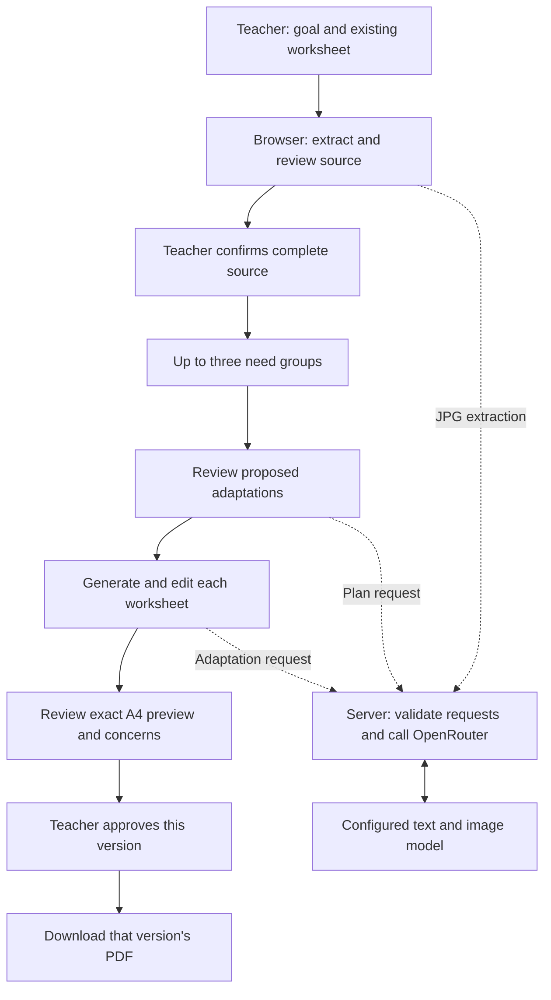

# CHLD Adapt — proposed architecture

**Status:** build proposal, 16 September 2026. This describes software to build; it is not a record of an implemented or tested application.

Read alongside the [PRD](PRD.md), [design brief](DESIGN.md) and [project plan](project-plan.md). The PRD governs scope. The approved first release is the one-hour subset below; the broader architecture remains recorded for subsequent work.

## 0. Approved one-hour implementation profile

Build one pasted-text worksheet journey for one group: confirmed source → live adaptation plan → live editable adaptation → teacher review → approval → exact A4 PDF download. Use the [selected Stitch direction](stitch/README.md) for the interface. M0 preparation precedes the four 15-minute build milestones; stop at 60 minutes and report the last passing milestone.

- **Application:** Next.js/TypeScript, one browser-memory workflow state, one group and all eleven checklist options. No database, accounts or persistent browser storage.
- **AI:** server-side `POST /api/plan` and `POST /api/adapt`, with `OPENROUTER_MODEL=qwen/qwen3.7-flash`. Validate output and preserve source question references. Missing credentials are a configuration error, not permission to use simulated results. A live probe during M0 must establish actual model availability, response behavior and cost before the clock starts.
- **Source:** simple text-only worksheets with teacher-confirmed completeness. Retain stable question references through corrections and generation. Reject continuation when essential visual content is missing. Defer all upload readers, `/api/extract-photo`, source-image assets and multi-group handling.
- **Review/export:** a fixed readable A4 template with adequate answer space. Render the actual PDF preview before approval, retain those exact bytes, and gate download on current approval. Keep revision/request IDs, concern review and all relevant approval resets from Sections 5–6. Defer extra font/layout controls and line-drawing templates.
- **Deployment:** Cloud Run in `us-central1`, using the owner-selected project `vibecoda-499712` and account `trishan@lunr.studio`. Use the dedicated CHLD build/runtime identities in the [M0 setup record](setup.md); do not rely on the global CLI default. Store the OpenRouter key and class password in Secret Manager; inject them only on the server. Use HTTP Basic authentication over HTTPS for all application and AI routes, with a shared username `class` and the stored password. No unauthenticated route may trigger a paid call.
- **Operating limits:** initial $5 OpenRouter key limit; bounded input/output sizes, request timeouts and no unbounded retries. Missing authentication configuration must fail closed. Keep source content, passwords and keys out of logs and client bundles.
- **Done:** local and deployed reading/mathematics journeys pass, including errors, approval resets, late results, PDF layout and wrong-password checks. Model quality and classroom effectiveness remain unproven beyond recorded examples.

The [M0 setup record](setup.md) tracks prepared infrastructure and outstanding credential checks; no application is deployed yet. The [project plan](project-plan.md) defines the current acceptance gates. The fuller components and two-session build sequence below apply only as their follow-up issues are scheduled.

## 1. The approach

Build one **Next.js application using React and TypeScript**, with a teacher workspace in the browser and a small server component that calls OpenRouter. Keep the current lesson in browser memory. Generate printable PDFs from structured worksheet content, with explicit teacher approval of each version.

This keeps the interface, model calls and document templates in one repository. There is no need for a database, learner accounts, a document library or an agent framework to demonstrate the agreed journey.

The model proposes adaptations; photo reading is subsequent work. Application code controls the workflow, preserves source references and manages approval. The teacher decides whether the material is suitable.

The diagram below shows the broader target. The first release uses pasted text and one group, omitting the JPG path.

## 2. Model choice and cost

**Proposed default: `qwen/qwen3.7-flash` through OpenRouter.** It accepts text and images at a comparable or lower listed token price than the requested DeepSeek V4 Flash. Use it for adaptation plans and worksheet generation in the MVP; evaluate photo extraction when that follow-up is built.

OpenRouter catalog snapshot, checked **16 September 2026**; USD per million tokens:

| Model ID | Text/image input | Input | Output | Role |
| --- | --- | ---: | ---: | --- |
| `deepseek/deepseek-v4-flash` | Text only | ~$0.089 | ~$0.177 | Requested model; cannot directly read photos |
| `qwen/qwen3.7-flash` | Both | $0.03 | $0.13 | Proposed default |
| `deepseek/deepseek-v4.1-flash` | Both | $0.15 | $0.60 | DeepSeek alternative at a higher price |
| `google/gemini-2.5-flash-lite` | Both | $0.10 | $0.40 | Alternative to evaluate if needed |

These are catalog rates, not a fixed quote for every provider. Qwen's input/output rates rise to $0.10/$0.40 at 32,000 prompt tokens and $0.20/$0.80 at 256,000. DeepSeek V4.1 Flash lists scheduled peak rates of $0.30/$1.20. Check routing and image billing before implementation. Sources: [live OpenRouter catalog](https://openrouter.ai/api/v1/models) and [Qwen provider endpoint](https://openrouter.ai/api/v1/models/qwen/qwen3.7-flash/endpoints).

Choose on worksheet quality as well as price. These listings establish capability and pricing, **not accuracy on our worksheets**. Before committing to the default, test reading and mathematics adaptations, valid output, response time and recorded cost. Test clear printed photos before enabling the later photo feature. If Qwen fails, evaluate the named alternatives and record the decision; do not silently switch to a more expensive model.

Keep `OPENROUTER_API_KEY` and `OPENROUTER_MODEL=qwen/qwen3.7-flash` in server environment settings. The model is a configuration choice, so changing it should not require rewriting the screens. Use an explicit model ID rather than an automatic model selector. The team's coding assistant can still be whichever environment and model each person normally uses.

## 3. Components and responsibilities

The table includes the broader target. Source readers for DOCX/PDF/JPG are **not in the one-hour MVP**; the first release needs pasted-text intake, the state machine, model adapter and PDF renderer only.

| Component | Proposed implementation | Why it is needed |
| --- | --- | --- |
| Teacher workspace | React screens following DESIGN.md; one reducer/state machine | Centralizes changes so approval and recovery rules stay consistent |
| Web server | Next.js Node route handlers | Keeps the OpenRouter key private and validates requests before spending money |
| Source readers | Mammoth for DOCX; PDF.js for selectable-text PDFs and source previews; image decoding for JPG/JPEG | Converts supported uploads into content the teacher can check |
| Model adapter | One server module calling OpenRouter | Keeps prompts, response validation and model selection out of interface components |
| Shared content schema | TypeScript types with runtime validation, for example Zod | Rejects incomplete or malformed model results before they reach the worksheet editor |
| Worksheet renderer | Fixed React PDF templates using `@react-pdf/renderer` | Produces consistent A4 pages from approved content |
| Session storage | Browser memory only | Supports the agreed session without creating a saved library |

These are proposed libraries, not installed dependencies. Official references: [Next.js route handlers](https://nextjs.org/docs/app/getting-started/route-handlers), [Mammoth](https://github.com/mwilliamson/mammoth.js), [PDF.js](https://mozilla.github.io/pdf.js/) and [React PDF](https://react-pdf.org/docs/v4/advanced).

Start with `POST /api/plan` and `POST /api/adapt`; add `POST /api/extract-photo` in the photo follow-up. Each adaptation request concerns one group. PDF rendering runs in the browser; later DOCX/PDF parsing can also run there. The server does not need to store files or generate downloads.

## 4. Getting the source right: pasted text now, uploads later

All inputs become the same internal worksheet structure: instructions, passages, stable question IDs, response spaces and any required visual assets. Keep the original source available for comparison. Assign question IDs in application code and preserve them through adaptation.

| Input | Processing and review |
| --- | --- |
| Pasted text | Show editable source content and check completeness before proceeding |
| Word `.docx` | Extract paragraphs, lists, tables and embedded images; convert into supported blocks and expose conversion warnings |
| Selectable-text PDF | Extract text and show rendered original pages; retain required visual regions as source assets |
| One `.jpg` / `.jpeg` | Display the original beside editable model-extracted content; require teacher confirmation of questions, numbers, instructions and diagrams |

For photos, send the image through the server as an inline image with the extraction instructions. A publicly accessible image URL is unnecessary. OpenRouter supports local images encoded in a request; see its [image-input documentation](https://openrouter.ai/docs/guides/overview/multimodal/image-understanding).

**Required diagrams remain source material.** Preserve usable embedded images, or an unchanged crop of a PDF page/photo, as assets linked to the relevant question. The teacher must inspect any proposed crop for missing labels or context. The model can suggest a region, but cannot establish that the crop is complete. If the intake cannot faithfully retain an essential diagram, table or visual, require a readable replacement source. A text description, confirmation click or newly invented drawing cannot substitute for it.

Simple new line drawings are a separate feature: select from a small set of reviewed drawing templates, and let the teacher review their use. Do not ask the model to produce arbitrary SVG, HTML or custom illustrations.

Reject scanned PDFs, multiple photo pages and handwriting recognition requests with the existing recovery flow. For blurry, cropped or unsupported material, preserve the lesson fields and offer another upload or pasted text; text recovery is sufficient only when no essential visual is lost. Never guess an unreadable number.

Mammoth does not sanitize its HTML output. Convert it to the allowed block structure, discard active content and external links, and render only trusted components. Do not insert uploaded or model-generated HTML directly into the page. Validate actual file type, file size and image dimensions; set practical limits during the first fixture tests and show them before upload.

## 5. From confirmed source to adaptations

Keep three small prompt templates under version control:

1. **Extract photo:** transcribe source content, identify uncertain regions and required visuals, and report unreadable content. Do not adapt or answer questions.
2. **Propose plan:** use the confirmed source, shared learning goal and each group's selected needs to suggest a short approach for teacher review.
3. **Adapt one group:** apply that group's reviewed plan, returning worksheet blocks, source question references, a brief change summary and review concerns.

Include all eleven checklist categories and Victoria's current explanations as shared constants copied from the PRD. Allow one to three selections per group and the optional difficulty field. Preserve the source language; do not add automatic translation.

Treat source text and optional notes as data, even when they contain instructions aimed at the AI. The server supplies the transformation rules. Model output cannot approve a worksheet, waive missing source content or request tools.

Return structured JSON rather than a finished page. For example, a variant contains `groupId`, `blocks`, `sourceQuestionIds`, `changeSummary` and `concerns`. Blocks can represent a passage, instruction, numbered question, answer space, reference box, section checkbox or approved visual asset. Appearance uses a small set of supported options for font, size, spacing and page breaks.

Qwen's current endpoint advertises `response_format`, but not an explicit `structured_outputs` guarantee. Use supported JSON mode and validate every response in the server; do not assume JSON Schema enforcement. For a model/provider verified to support strict schemas, use that facility as well. OpenRouter documents both [structured outputs](https://openrouter.ai/docs/guides/features/structured-outputs) and [required provider parameters](https://openrouter.ai/docs/guides/routing/provider-selection). Live request tests must confirm the selected route's behavior.

Validation rejects blank content, invalid blocks, missing/duplicated question IDs and unknown asset references. Run the same content checks after teacher edits and before approval. Check for omitted questions and changed numbers; flag possible answer disclosure, altered response skills or changed learning goals for teacher review. Mechanical checks cannot prove educational equivalence.

For presentation-only changes, keep confirmed wording and question content fixed and change layout properties. Simplification, examples, familiar contexts and alternative response formats require the review described in the PRD. Shorter sections must retain every required item. A clean model response is never evidence that the worksheet is educationally suitable.

Use a bounded retry for malformed output, then show an actionable error. Preserve the source, group settings and other completed variants. Avoid repeated automatic retries that spend money without improving the result.

## 6. State, approval and PDF integrity

Keep one lesson state containing:

- **Source:** original input, confirmed blocks/assets, source revision and confirmation status.
- **Lesson:** shared goal, grade and age range, with a revision.
- **Groups:** neutral label, selected needs, optional context and reviewed plan, with a revision per group.
- **Variants:** editable content, concerns, revision, request ID, preview PDF and approval snapshot.

An approval snapshot records the exact content, relevant source/lesson/group revisions, resolved concerns, print settings and PDF bytes the teacher reviewed. Think of it as approving a particular photograph of the worksheet, rather than approving a document that can keep changing underneath it.

| Event | Required state change |
| --- | --- |
| Extraction or source correction | Require source confirmation; invalidate affected plans and all variant approvals |
| Learning goal or lesson context changes | Invalidate plans and all variant approvals |
| Group needs/context or plan changes | Invalidate that group's generated result and approval |
| Variant content, typography, spacing or visuals change | Clear that variant's approval and old downloadable PDF; rebuild its preview |
| Regenerate | Clear approval immediately; only the latest request may replace the draft |
| Approve | Require current source confirmation, complete content, resolved concerns and a ready preview; store the current snapshot |
| Download/re-download | Permit only the snapshot matching every current revision |

Attach request IDs and input revisions to extraction, planning, generation and PDF-rendering jobs. Ignore a late result if its inputs have changed or a newer request exists. Otherwise, a slow earlier request could overwrite a teacher's corrections. Retrying Group B must leave Groups A and C intact.

Concern confirmation and whole-worksheet approval are separate actions. A teacher can explicitly confirm that a flagged adaptation retains the goal; missing essential source content must instead be corrected and cannot be waived.

Build the PDF preview from an immutable draft snapshot, then show those actual pages for review. On approval, retain those exact PDF bytes for download; do not ask the model or renderer to recreate the worksheet at download time. A rendering failure blocks approval of that version. Expose download controls only for current approved snapshots. This is a teacher-workflow safeguard, not a claim that browser content cannot be copied.

Follow DESIGN.md's print rules: A4, high contrast, adequate answer space, readable text, optional handwriting-style type, sentence-per-line layouts and extra spacing. Bundle licensed fonts so previews and downloads use the same fonts. Use controlled page breaks and keep questions, associated diagrams and response areas together where possible. Inspect actual rendered pages for clipping and readability.

## 7. Session handling and running the demo

Keep editable content, source files and PDFs in memory; do not use local storage, a database or uploaded-file archives. Normal errors retain work in the open session. Reloading or closing loses it, so show the session notice and make approved PDFs easy to download. Closing the browser is not a promise that OpenRouter or its providers erase their processing records.

Use fictional worksheets and group needs. Send only the context needed for each model call. Keep worksheet text, images, optional notes and API keys out of logs and Git. Record only operational information needed for the demo: model, duration, token usage/cost and success/error category.

Run locally first, then deploy the tested MVP to Cloud Run. Use the shared-password protection defined in Section 0 across the application and AI routes. Set the $5 OpenRouter key limit, server request/output limits and timeouts before opening class access. Missing password or key configuration must not leave a working, unprotected paid endpoint. GCP project, billing, APIs, deployment permissions and Secret Manager access must be ready in M0.

Use GitHub Issues and a GitHub Project for the work. Keep secrets in local/hosting environment settings and commit only a placeholder `.env.example` when implementation begins. Lock dependency versions once chosen.

## 8. Broader prototype: original build order and acceptance checks

The first release follows the four timed milestones in [project-plan.md](project-plan.md). The original two-session scope and full acceptance set below remain follow-up requirements, not extra work inside the hour.

**Build session 1 — one complete journey.** Create the workspace, shared state and schemas; support paste, DOCX and selectable-text PDF intake with review; connect planning and one-group generation through OpenRouter; add editing, exact PDF preview, approval and download. Demonstrate a fictional worksheet and recovery from an unavailable or malformed model response.

**Build session 2 — the agreed full scope.** Add up to three independent groups, single-page JPG/JPEG intake and source comparison, all checklist explanations, optional context, print/readability controls, simple reviewed drawings and engagement supports. Finish invalidation and late-response handling, then prepare the pitch and working demonstration.

Before calling the prototype ready for its learning test:

- Run reading and mathematics fixtures, a three-group journey and examples covering all eleven checklist options.
- Check a clear photo, a wrong extracted number, blurry/cropped input and missing diagram content. Recovery must preserve inputs; completeness cannot be waived.
- Exercise failed and out-of-order requests. They must not replace newer edits or damage another group's work.
- Approve, edit, change a group need, change the source and change the goal. Confirm exactly the affected approvals reset and stale downloads are unavailable.
- Check answer-revealing supports and response-format changes when writing/drawing is the assessed skill. Require teacher review rather than automatic reassurance.
- Inspect PDFs with larger text, handwriting-style type, separated sentences, drawings, checkboxes and section endpoints. Preserve all questions, required reasoning and adequate answer space.
- Record live model/cost/latency results and languages tested. Measure the full teacher journey against the PRD's ten-minute target, including corrections; it remains a test target.

Use focused automated tests for state transitions, response validation and stale results, plus an end-to-end browser check and visual PDF review. Educational suitability still needs Victoria's and the intended teacher's judgment. Record findings and model changes in `docs/evidence-and-decisions.md` when testing begins.

The first step is M0 setup, followed by the single-group pasted-text journey. Saved accounts, persistent workspaces, integrations and broader automation remain outside this build.
