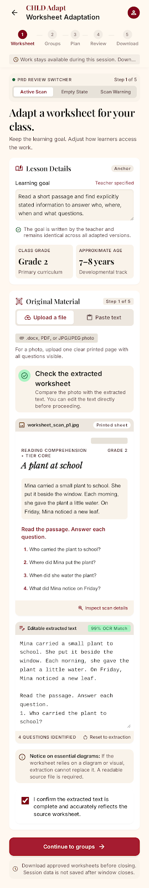
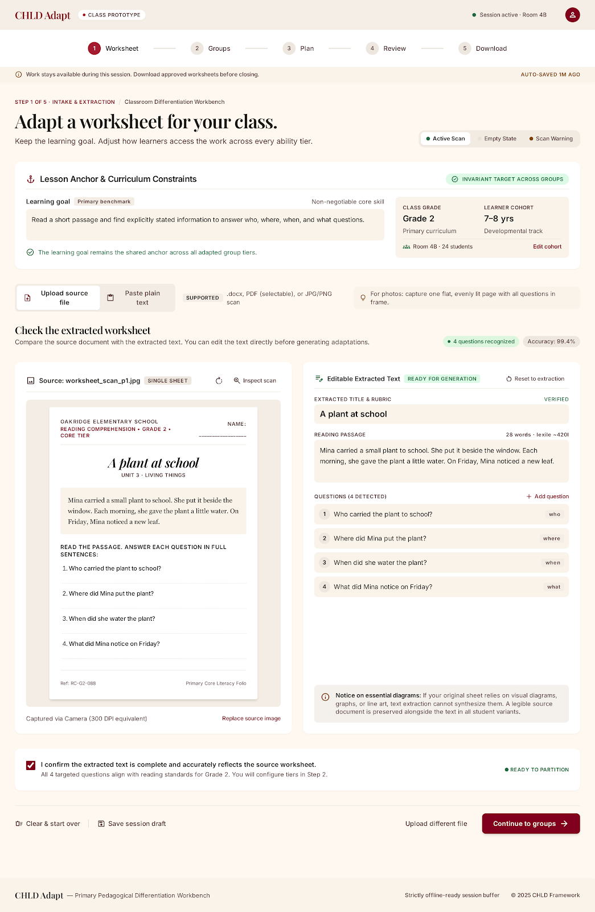
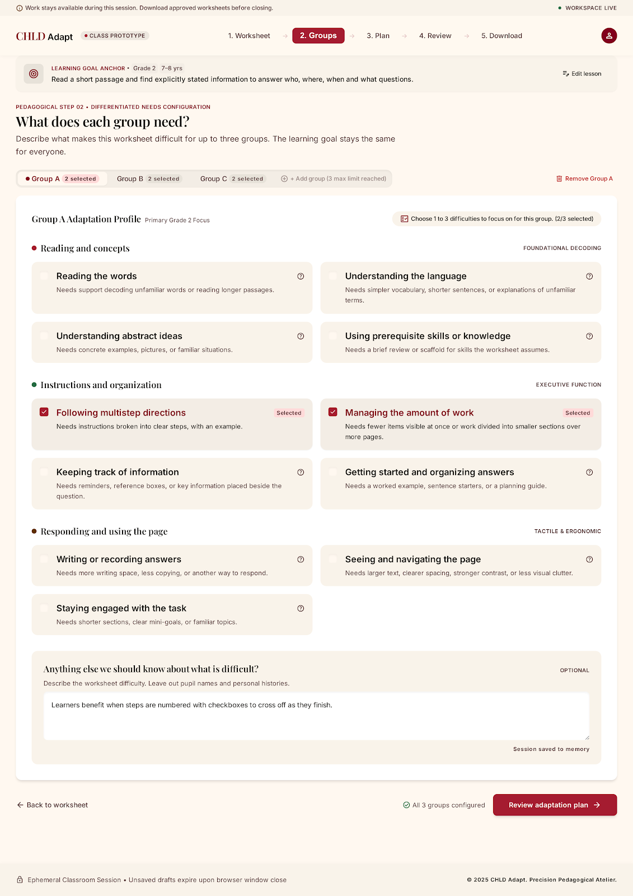
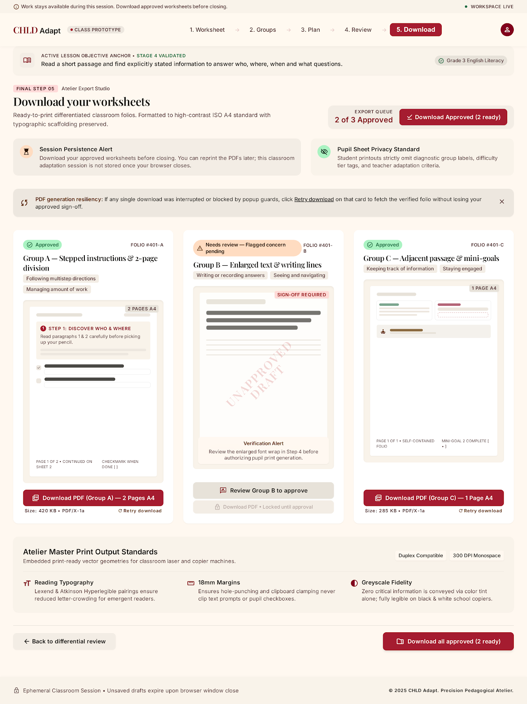
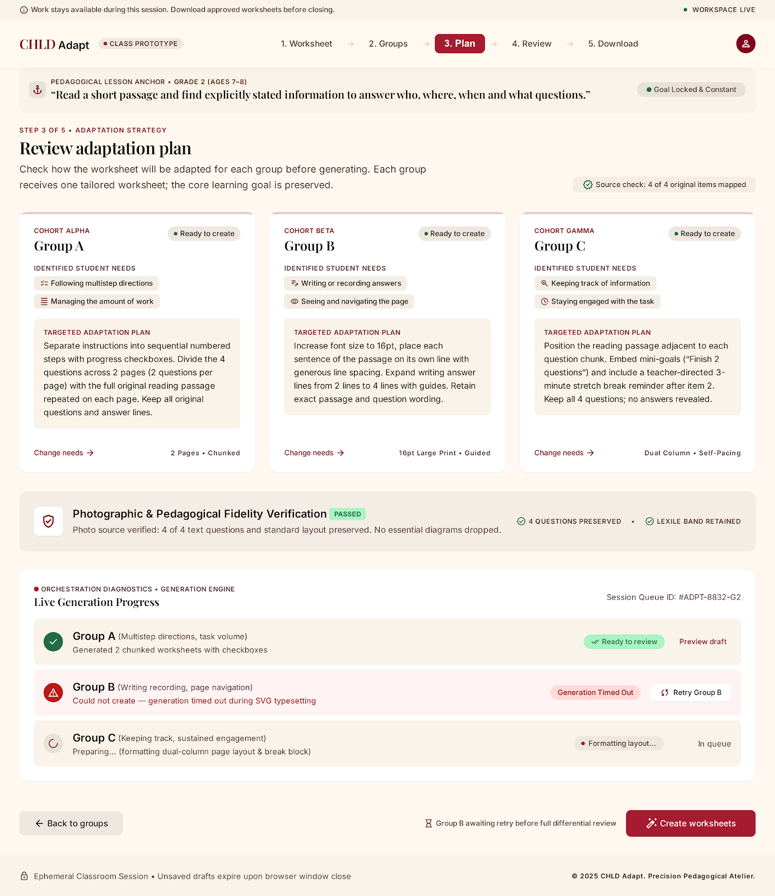
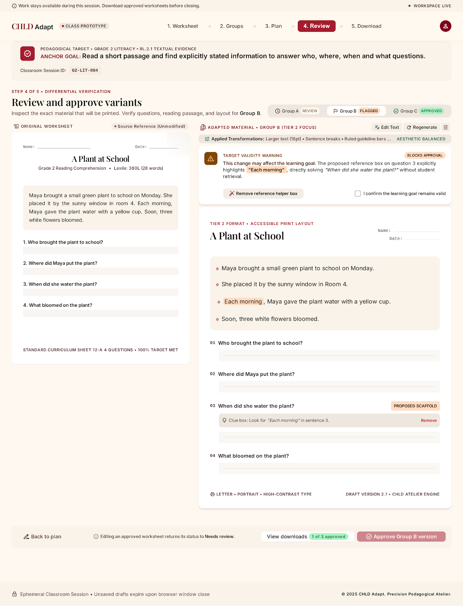

# Stitch Prototype Import: CHLD Adapt

This folder preserves the original Stitch static prototype export for the CHLD Adapt final-project direction. The exported files are reference material for visual direction and product framing only. They are not a working application and should not be treated as implementation-ready code.

Archive SHA-256:

```text
686b1a00a1f9859402c84fe966f8fbe034005de7ed4a1d6b538a40fc9d69a2c8  stitch_chld_adapt_prototype.zip
```

## Original Export

- [Original ZIP archive](stitch_chld_adapt_prototype.zip)
- [Original Stitch style guide](stitch_chld_adapt_prototype/editorial_workshop/DESIGN.md)

## Approved Visual Direction

Use the warm paper direction from the Stitch export as the visual reference:

- Background: warm paper `#FFF8F0`
- Deep crimson: `#81001D`
- Accent crimson: `#A51C30`
- Typography: Playfair Display for editorial headings, Inter for interface text
- Layout emphasis: side-by-side review, clear human approval moments, restrained academic editorial polish

## Static Prototype Screens

| Screen | Preview | Original code |
|---|---|---|
| Worksheet intake extraction review | [](stitch_chld_adapt_prototype/your_worksheet_intake_extraction_review/screen.png) | [code.html](stitch_chld_adapt_prototype/your_worksheet_intake_extraction_review/code.html) |
| Worksheet intake extraction review, desktop | [](stitch_chld_adapt_prototype/your_worksheet_intake_extraction_review_desktop/screen.png) | [code.html](stitch_chld_adapt_prototype/your_worksheet_intake_extraction_review_desktop/code.html) |
| Student groups | [](stitch_chld_adapt_prototype/what_does_each_group_need_student_groups_desktop/screen.png) | [code.html](stitch_chld_adapt_prototype/what_does_each_group_need_student_groups_desktop/code.html) |
| Print export | [](stitch_chld_adapt_prototype/download_your_worksheets_print_export_desktop/screen.png) | [code.html](stitch_chld_adapt_prototype/download_your_worksheets_print_export_desktop/code.html) |
| Adaptation strategy review | [](stitch_chld_adapt_prototype/review_the_plan_adaptation_strategy_desktop/screen.png) | [code.html](stitch_chld_adapt_prototype/review_the_plan_adaptation_strategy_desktop/code.html) |
| Side-by-side approval | [](stitch_chld_adapt_prototype/review_and_approve_side_by_side_comparison_desktop/screen.png) | [code.html](stitch_chld_adapt_prototype/review_and_approve_side_by_side_comparison_desktop/code.html) |

## Required Implementation Corrections

When converting this visual direction into the real one-hour MVP, do not carry over claims or controls that overstate what the product can do.

Remove or correct:

- False `99.4% accuracy` claims
- Unsupported autosave claims
- Unsupported offline claims
- Ability tiers or diagnostic labels that imply clinical or formal learner assessment
- PNG upload controls, additional upload controls, and ZIP batch download controls for the one-hour MVP
- Letter-sized output; use A4
- Fake print-certification language

The selected one-hour MVP should support:

- Paste one text worksheet
- Work with one group
- Use a live OpenRouter-backed plan/adapt flow; missing configuration shows an error rather than substituting a fixture
- Let a human review and approve the adaptation
- Generate an actual PDF

The one-hour MVP should not include:

- File uploads
- Accounts
- Persistent storage
- Batch download
- Claims of validated accuracy, offline reliability, or certification
